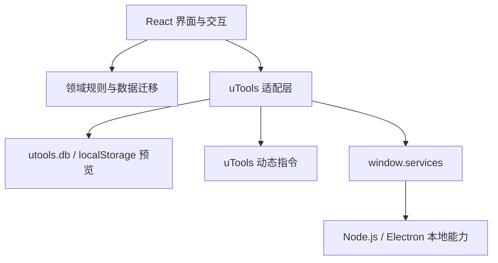

# 架构说明

## 设计目标

1. 对 1.x 用户数据保持向后兼容。
2. 使 React 组件不直接依赖 Node.js 和 Electron。
3. 使数据迁移、导入、去重和排序成为可独立测试的纯函数。
4. 使本地浏览器预览可以不依赖 uTools 运行。

## 分层



### `domain`

不访问 DOM、uTools 或 Node.js，负责：

- 历史数据规范化。
- URL 补全和表单校验。
- 导入去重。
- 搜索和排序。

### `adapters`

隔离外部 API：

- `database.ts` 读写 `launcher-items`，浏览器预览时使用 localStorage。
- `features.ts` 管理 `item_${id}` 动态指令并清理失效指令。
- `platform.ts` 统一启动和路径检查结果。

### `public/preload`

`preload/services.js` 是独立 CommonJS 文件，必须保持源码可读，不参与 Vite 打包、压缩或混淆。仅在这一层访问：

- Electron `shell`
- Node.js `fs` / `path`
- Node.js `child_process`

## 数据兼容合同

同步文档始终保持：

```ts
interface LauncherDocument {
  _id: 'launcher-items'
  _rev?: string
  data: LauncherItem[]
  schemaVersion?: number
  updatedAt?: number // UTC Unix 秒级时间戳
}
```

不得在没有迁移、回滚方案和真实旧数据测试的情况下更改 `_id`、`data` 或动态指令前缀。

## 状态原则

- 资源数组是核心用户数据，每次用户操作后写入同步数据库。
- 搜索词、当前筛选、弹窗、拖拽状态和路径检查结果只保存在内存中。
- 文件图标由 uTools 现场生成，不写入同步数据库。
- 时间字段使用 UTC Unix 秒级时间戳；历史 `createdAt` 数据原样保留。

## 测试边界

- `domain` 测试历史数据、校验、导入和排序。
- `adapters` 测试 `_rev` 写回和旧文档结构。
- 组件测试用户可见的主要流程。
- 发布前还需在 Windows、macOS 和 Linux 中至少各验证一次本地资源和命令启动。
